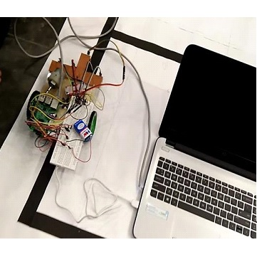

  
  
  
  

Monitoring the environmental factors is not the complete solution to increase the yield of crops. Our system aims to make cultivation and irrigation more efficient as the farmer is able to make better informed decisions based on the data sent by sensor nodes at appropriate time and thus save time and resources. The diversity of location and climatic effects upon agricultural cultivation, along with other environmental parameters over time makes the farmer’s decision-making process more complicated and requires additional empirical knowledge. Applying wireless sensor networks for monitoring environmental parameters and combining this information with a user-customized web service may enable farmers to exploit their knowledge in an efficient way in order to extract the best results from their agricultural cultivation.

This data is sent to the farmer through interface of a website using raspberry Pi. After receiving the data farmer takes appropriate action by sending commands to the bot to perform the task via Application interface. The bot will then perform the necessary task such as watering the regions which require water in sufficient quantity. The bot will cater to the needs of the region as indicated by the soil moisture sensor autonomously. This bot can also be used for Livestock monitoring using image processing with help of camera module attached to the bot. The bot is mobile and can move around the field on a grid into which the farm will be segregated using the concept of maze solver bot.

Here is some code that illustrates how we read values from the line sensors:

Here is video that illustrates how we read values from the line sensors and control the bot: [Video] (https://vimeo.com/336328309).

