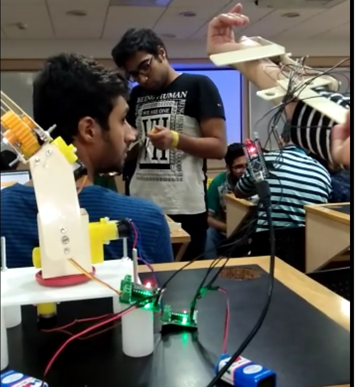
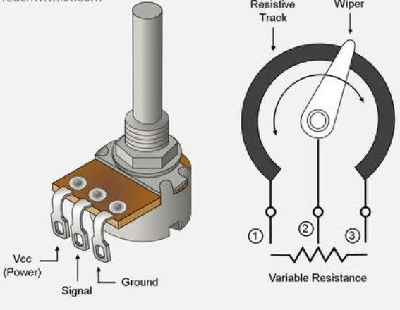
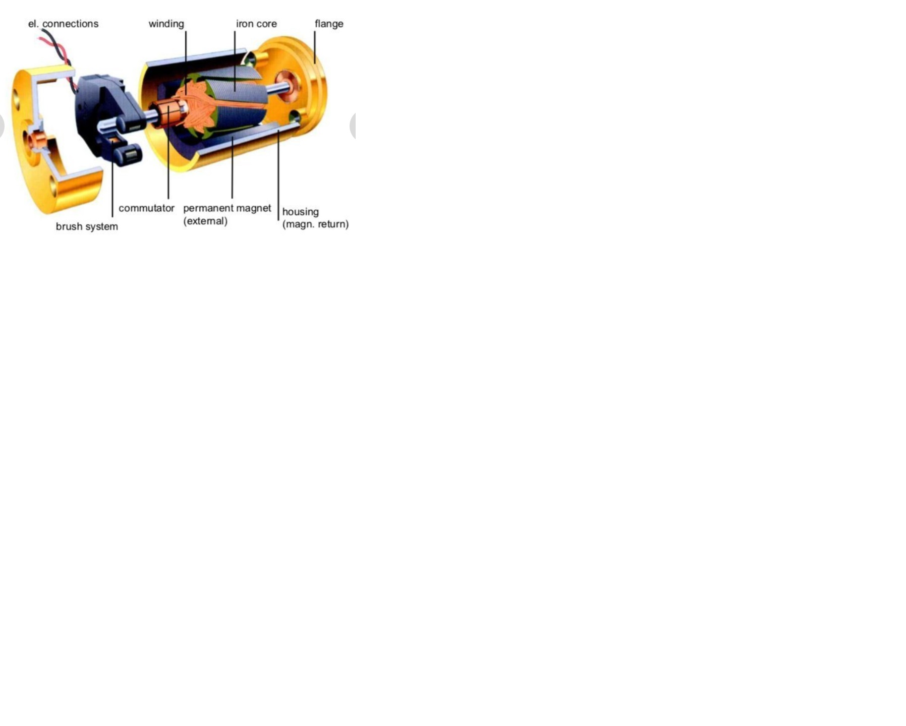
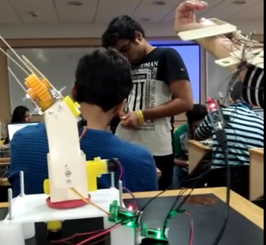

  
  
  
  

Haptics (pronounced HAP-tiks) is the science of applying touch (tactile) sensation and control to interaction with computer applications.The project is on creating an artificial arm prototype that mimics the human hand. We use pots at all the joints and as my hand moves the value of the Pot changes resulting in resistance variation which inturn affects the current. This is taken as an analog input on the microcontroller and we go-ahead with adjusting the motor shaft motions of the artificial arm depending upon the current values provided from the human arm. The pots attached to the human arm vary their resistance depending on the motion of the arm. The analog values act as input for the microcontroller which in turn gives corresponding output signals to the motor driver circuit which controls the motion of the motors of the artificial arm.The Robotic Arm is comprised of several servos at various joints which are in correspondence with the wiper positions of the potentiometers situated in Remote controlling unit to control the movement of Robotic Arm.The potentiometer converts the mechanical movement into electrical signal proportional to the magnitude of external motion by changing its internal resistance.

Here's a video which illustrates this project in detail [Video](https://vimeo.com/499512162).

