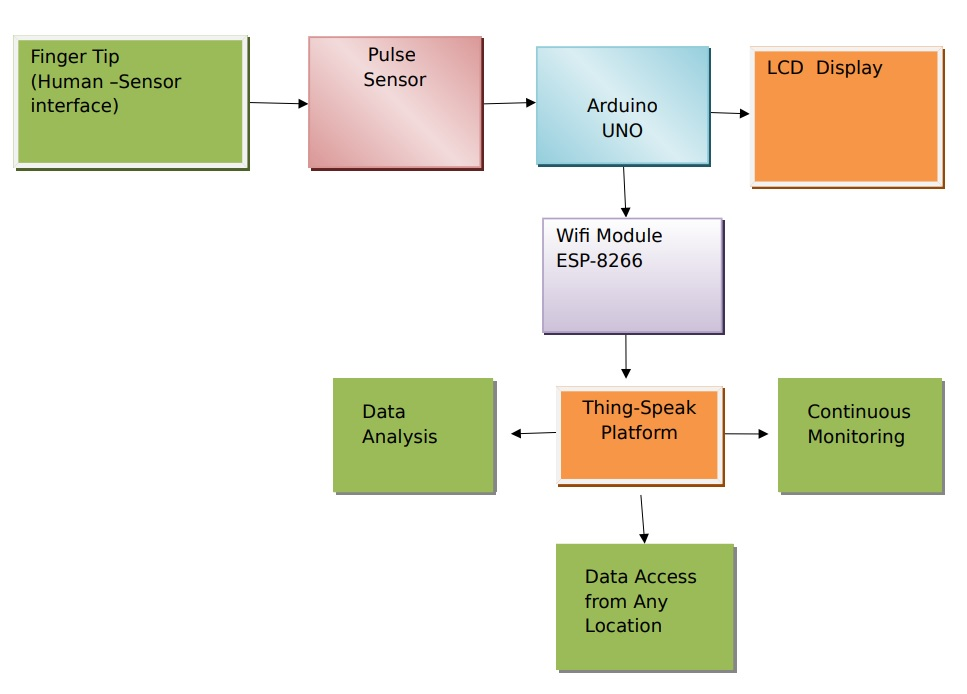
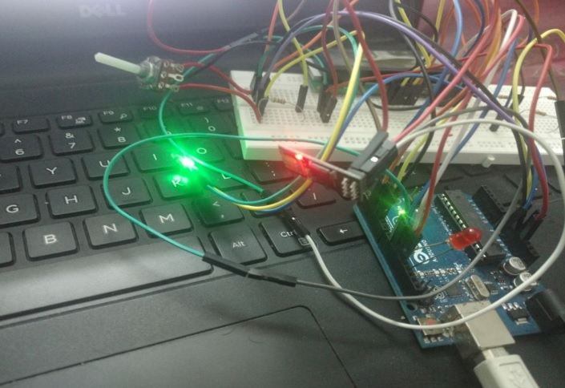
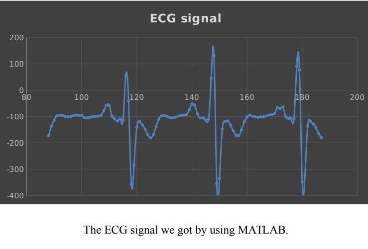

  
  
  
  

In this project we are going to make a Heart Beat Detection and Monitoring System using Arduino that will detect the heart beat using the Pulse Sensor and will show the
readings in BPM (Beats Per Minute) on the LCD connected to it. It will also send the readings to Thing-Speak server using the Wi-Fi module ESP8266, so that Heart Beat
can be monitored from anywhere in the world over the internet. Now-a-days the development and usage of the mobile systems and wireless networks became prominent. There is an enhancement in telemedicine applications and patient monitoring. To improve cost reduction, resource management, time and patient care, the mobile systems and wireless networks will be an aid in hospital and other medical environments. The real-time information is useful for making critical decisions about the care of the patients, the demands on strength and consistency of wireless communication systems can be used by medical environment.

First we need to attach the Pulse Sensor to any organ of body where it can detect the pulse easily like finger, check the video below. Then the Pulse Sensor will measure
the change in volume of blood, which occurs when every time heart pumps blood in the body. This change in volume of blood causes a change in the light intensity through that organ. The Arduino will then convert this change into the heart beat per minute (BPM). The LED connected at pin 13 will also blink according the Heart Beat.
The ESP8266 will then communicate with the Arduino and will send the data to ThingSpeak. The ESP8266 will connect the network of your router that you will provide in the code and will send the data of the sensor online. This data on the ThingSpeak will be shown in a Graph form showing the past readings too and can be accessed from anywhere over internet. The LCD connected will also show you the BPM.

Here is some code that illustrates how we read values from the line sensors:

// Variables
int pulsePin = 0; // Pulse Sensor purple wire connected to analog pin 0
int blinkPin = 13; // pin to blink led at each beat
int fadePin = 5; // pin to do fancy classy fading blink at each beat
int fadeRate = 0; // used to fade LED on with PWM on fadePin
// Volatile Variables, used in the interrupt service routine!
volatile int BPM; // int that holds raw Analog in 0. updated every 2mS
volatile int Signal; // holds the incoming raw data
volatile int IBI = 600; // int that holds the time interval between beats! Must be seeded!
volatile boolean Pulse = false; // "True" when User's live heartbeat is detected. "False" when not a "live beat".
volatile boolean QS = false; // becomes true when Arduoino finds a beat.
// Regards Serial OutPut -- Set This Up to your needs
static boolean serialVisual = false; // Set to 'false' by Default. Re-set to 'true' to see Arduino Serial Monitor ASCII
Visual Pulse
void setup(){
pinMode(blinkPin,OUTPUT); // pin that will blink to your heartbeat!
pinMode(fadePin,OUTPUT); // pin that will fade to your heartbeat!
Serial.begin(115200); // we agree to talk fast!
interruptSetup(); // sets up to read Pulse Sensor signal every 2mS
// IF YOU ARE POWERING The Pulse Sensor AT VOLTAGE LESS THAN THE BOARD VOLTAGE,
// UN-COMMENT THE NEXT LINE AND APPLY THAT VOLTAGE TO THE A-REF PIN
// analogReference(EXTERNAL);
}
Here is a video that illlustrates the project [Video](https://vimeo.com/263332763).

