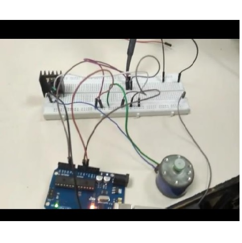
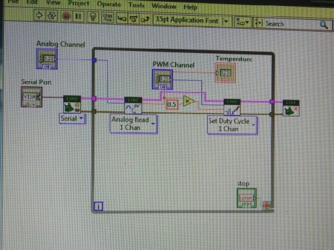
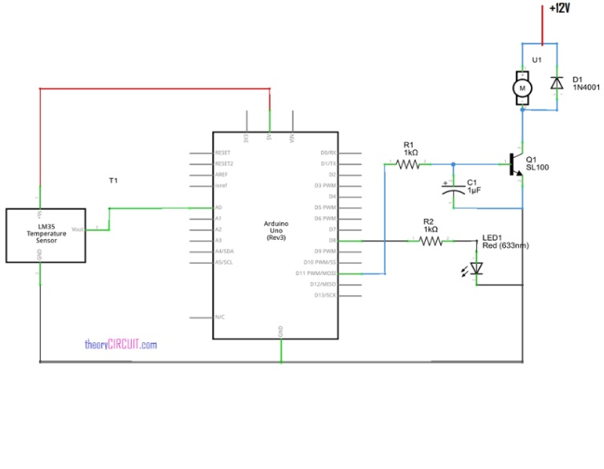

  
  
  
  

Instrumentation usually requires large investments, resulting in expensive monitoring or control systems, which generally are not able to perform the analysis and control of several signals simultaneously. Considering such cases, the new generation of acquisition systems, named virtual instruments (VI), have been considerably increased in the last few years. LabVIEW TM (Laboratory Virtual Instrument Engineering Workbench), a product of National Instruments, is a powerful software system that accommodates data acquisition, instrument control, data processing and data presentation. LabVIEW which can run on PC under Windows. All LabVIEW graphical programs, called Virtual Instruments or simply VIs, contains a Front Panel and a Block Diagram.In the present era automation is a popular technique which is seen almost everywhere starting from industrial application to consumer application. This project describes how the DC motor speed is automatically controlled through temperature variation. The use of DC motors were mostly found in AC machines like small cooling fans, rob arms toy cars etc.This project uses the LabVIEW platform which is made to be interfaced with the DC motor. The interfacing circuit is done on an Arduino board which is supported by the LabVIEW platform.Since the speed of the motor is controlled through temperature variation, temperature measurement circuit is also interfaced through LabVIEW. With respect to the change in the variation in temperature the dc motor speed can either be increased/decreased using the LabVIEW program.

The use of most of the electronic devices available in the market, in our day to day life seems to be an automated control type for e.g. device like personal computer CPUs need to be operated in a temperature controlled environment. This means the speed of the DC motor is directly maintained through temperature. Besides this, there are some industrial applications which follow the said procedure in maintaining a constant temperature working environment for the machines.The motor speed can be controlled in many ways. 
The method adopted here is low cost technique for the speed control of a DC motor. This project uses the LabVIEW platform which is made to be interfaced with the DC motor.The interfacing circuit is done on an Arduino board which is supported by the LabVIEW platform. Arduino Uno board acts as a data acquisition system.

Here's a video which illustrates the described Project [Video](https://vimeo.com/297578486).

