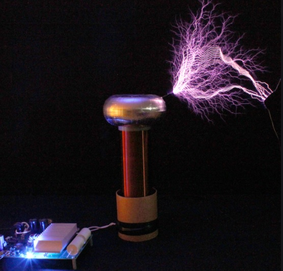
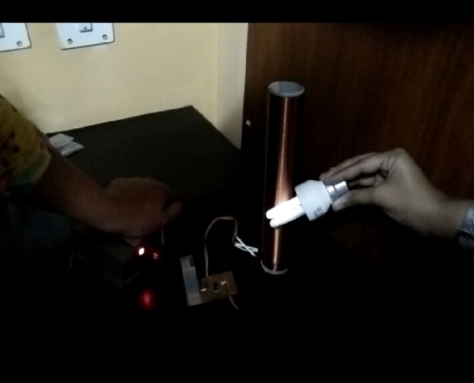
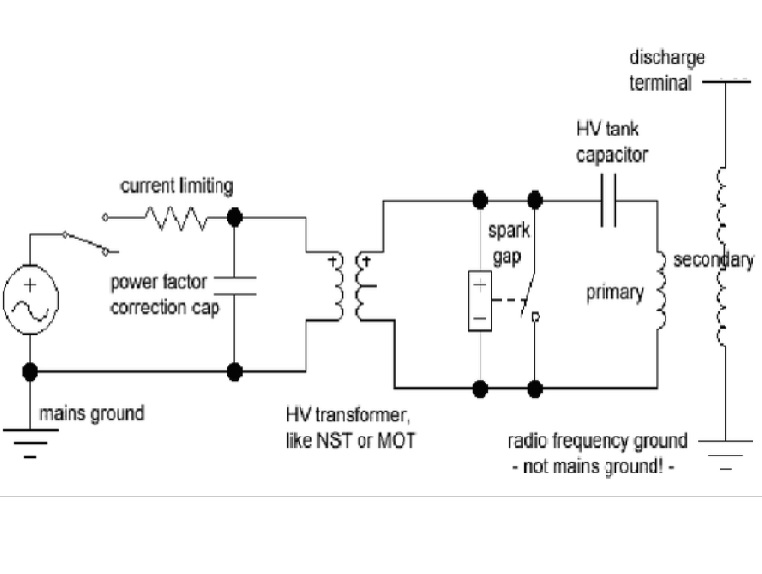
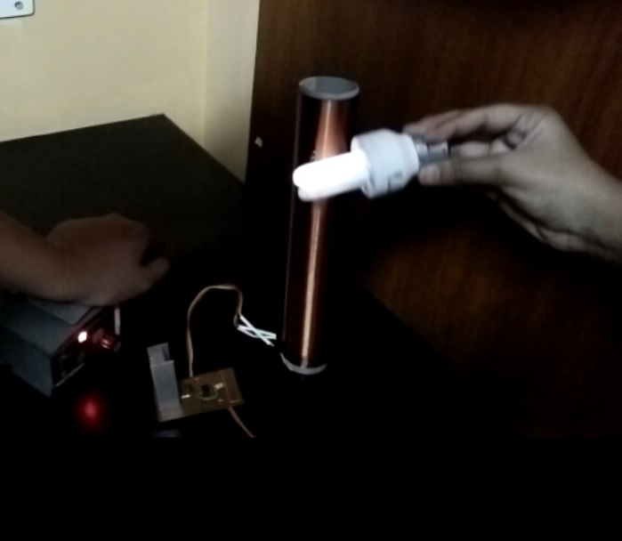

  
  
  
  

The world of wireless technology is here! Innumerable wireless applications like wireless powered lighting, wireless smart homes, wireless chargers and so on are developed due to wireless technology. In 1891, the most famous discovery of the Tesla coil was invented by the inventor Nikola Tesla. Tesla was obsessed with providing wireless energy, which led to the invention of the Tesla coil. This coil does not require a complex circuit and so it is part of our daily lives like remote control, smartphones, computers, X-rays, neon and fluorescent lights, and so on.

This coil has the ability to produce output voltages up to several million volts based upon the size of the coil. The Tesla coil works on a principle to achieve a condition called resonance. Here, the primary coil emits huge amounts of current into the secondary coil to drive the secondary circuit with maximum energy. The fine-tuned circuit helps to shoot the current from primary to secondary circuit at a tuned resonant frequency.This projects aims at wireless transfer of power using principles of Magnetic Induction. The transmitter coil is energized by AC to generate a magnetic field which in turn induces a current in the receiver coil..

Here's a video which illustrates this project [Video](https://vimeo.com/499510456).

