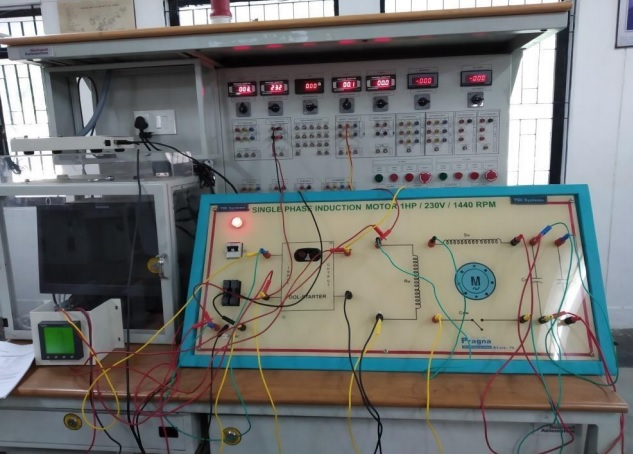
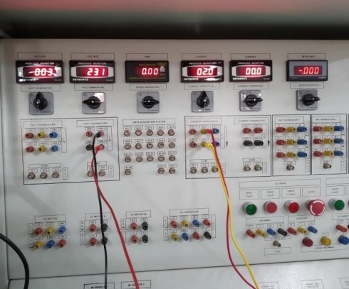
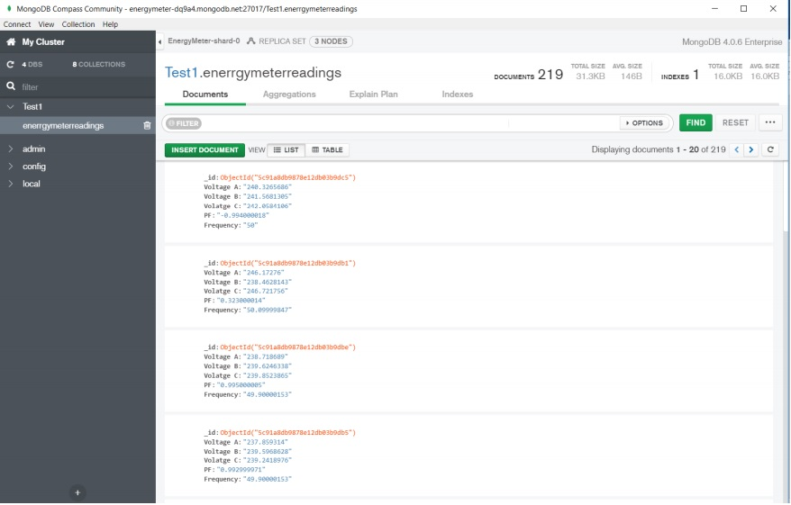

  
  
  
  

Our projects aims to receive the real time data from a single phase induction motor using NI DAQ with LABVIEW initially for monitoring the current and voltage obtained. Later the smart meter PM710 was used to take the real time value and then and later using an adapter from port RS485. Single Phase Induction Motor which consists of a single-phase winding mounted on the stator of the motor and cage winding placed on the rotor.Proportional torque is produced at the rotor, when the stator winding of the motor is energized by a single-phase supply and corresponding pulsating magnetic field.Aim of the experiment is to study the parameters like speed, torque, efficiency, output power, load current and percentage slip of the given single-phase motor.

Current voltage and speed of the motor are acquired with the appropriate sensors and implemented with the internet of things for remote experimentation and data logging. After this has been achieved we will aim to design a web page that will display the graphs of the parameters with respect to time.The current and voltage values displayed is monitored using a smart meter PM710 and the corresponding data is sent to cloud.

