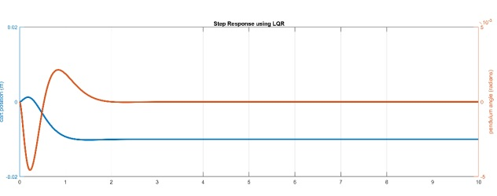

  
  
  
  

In this project an inverted pendulum is controlled using state space modelling method. And full state feedback controller is developed using pole placement and LQR (Linear Quadratic Regulation) methods. After that, tracking problem is addressed by designing a steady state error controller. Then, considering the reality conditions, first assuming by some of the state variables are measurable, a reduced state observer is designed and then for a worst scenario a full order state observer is designed. Finally, the state feedback controller and the state observer are summed up to give a precompensator and an overall steady state error controller is added to that new system. All mathematical modelling is presented clearly and simulations together with their analysis were done using MATLAB software. For clear view on what is going on with the control method and the system,an animation GUI is also presented.

As a typical control system, the control of an inverted pendulum is excellent in testing and evaluating different control methods. Its popularity derives in part from the fact that it is unstable without control, that is, the pendulum will simply fall over if the cart isn't moved to balance it. Additionally, the dynamics of the system are nonlinear. The objective of the control system is to balance the inverted pendulum by applying a force to the cart that the pendulum is attached to. A real-world example that relates directly to this inverted pendulum system is the attitude control of a booster rocket at take-off but The fundamental principles within this control system can be found in many industrial applications, such as stability control of walking robots, vibration control of launching platform for shuttles etc.

Modeling of an inverted pendulum shows that the system is unstable without a controller. Results of applying state feedback controllers show that the system can be stabilized. While both pole placement and LQR controller methods are cumbersome because of selection of constants of controller though they can brought a good result if done systematically with some guide lines. When a DC reference input is applied to the cart, the system has failed slightly to track the input and has given a stable output with some oscillations – unsatisfactory steady state performances. To eliminate this, a no steady state error tracking controller is designed and has brought good results as can be seen on the graphs in each steps.And since in reality all the states can’t be measured, a full-order state estimator (observer) is designed. Finally, the state feedback controller is summed with a full-order state observer to give a precompensator and then a steady state error tracking mechanism is also added to the whole new system. All those have brought a really nice controlled inverted pendulum system with good performance.

You can learn more at the [Website](https://ctms.engin.umich.edu/CTMS/index.php?example=InvertedPendulum&section=ControlStateSpace).

