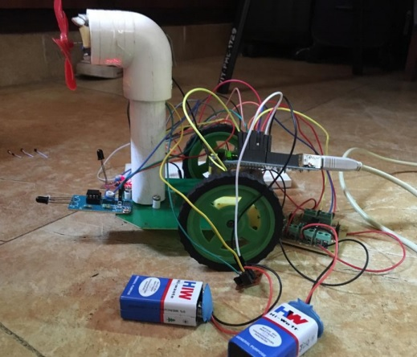
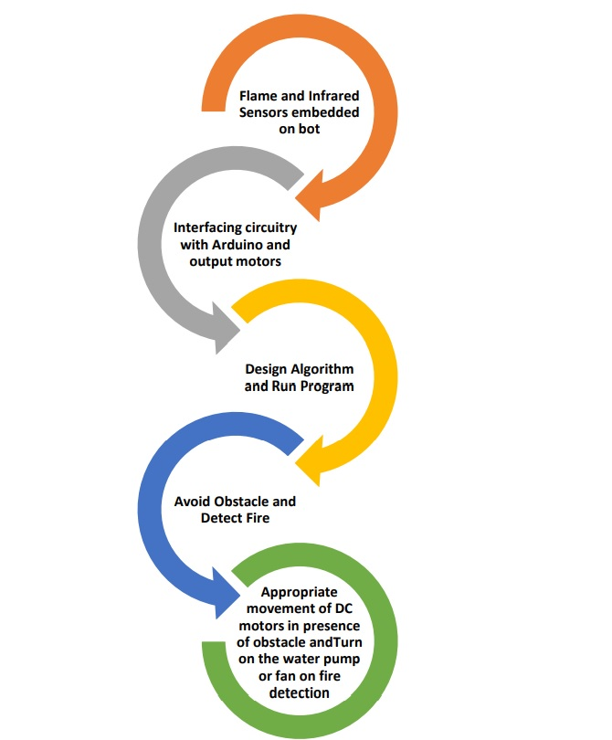
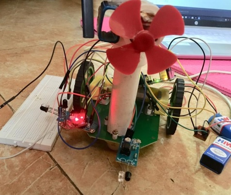

<div class="ui small rounded images">
  
  
  
  
</div>

In the present era automation is a popular technique which is seen almost everywhere starting from industrial application to consumer application. For the purpose of protecting fire fighters from extreme danger in petrochemical, chemical dangerous product, toxicoid or exploder fire accidents, an unmanned An Infrasonic Obstacle avoidance system with fire-fighting robot is designed and developed as a factory element of coming future Technology, In this project an Infrared based obstacle avoidance system used for fire fighting robot is presented. Microcontroller (AT89S52) is used to avoid the obstacle and fire detection with the help of infrasonic sensor and flame sensor. 

The microcontroller is used to drive sensors and the motors, which are needed for the robot to keep moving. Flame Sensor module is used for Fire detection whereas IR sensors are
used for Obstacle detection. To meet the need of obstacle detection in hostile fire field under heavy smoke and high temperature condition, the transducer, STC circuit and anti-jamming processing are specially designed at industrial level. Experiment and Analysis on fire fighting robot prove the efficiency of the system.


Now –a-days, many industries are using robots due to their high level of performance and reliability and which is a great help for human beings. The obstacle avoidance robotics is used for detecting obstacles and avoiding the collision. This is an autonomous robot. The design of obstacle avoidance robot requires the integration of many sensors according to their task. The obstacle detection is primary requirement of this autonomous robot. The robot gets the information from surrounding area through mounted sensors on the robot. Some sensing devices are used for obstacle detection like infrasonic sensor. Ultrasonic or Infrasonic sensor is most suitable for obstacle detection and it is of low cost and has high ranging capability. It is used to extinguish or control small fires, often in emergency situations with help of input flame sensor module whose output is connected to the water sprinkler motor or Fan. All mobile robots feature some kind of collision avoidance, ranging from primitive algorithms that detect an obstacle and stop the robot in order to avoid a collision, using some sophisticated algorithms, which enable the robot to detour obstacles. 
Here's a part of code 
```js
int FlameSensor = 0;
int IR1Pin = 1; // switch input
int IR2Pin = 2;
int motor1Pin1 = 3; // pin 2 on L293D
int motor1Pin2 = 4; // pin 7 on L293D
int motor2Pin1 = 5;
int motor2Pin2 = 6;
int FanPin1 = 7;
int FanPin2 = 8;
void setup() {
 // set the switch as an input:
 pinMode(FlameSensor, INPUT);
 pinMode(IR1Pin, INPUT);
 pinMode(IR2Pin, INPUT);
 pinMode(motor1Pin1, OUTPUT);
 pinMode(motor1Pin2, OUTPUT);
 pinMode(motor2Pin1, OUTPUT);
 pinMode(motor2Pin2, OUTPUT);
 pinMode(FanPin1, OUTPUT);
 pinMode(FanPin2, OUTPUT);
 }
void loop()
{
if (digitalRead(FlameSensor) == LOW)
{
 digitalWrite(motor1Pin1, LOW); // set pin 2 on L293D low
 digitalWrite(motor1Pin2, LOW); // set pin 7 on L293D high
 digitalWrite(motor2Pin1, LOW);
 digitalWrite(motor2Pin2, LOW);
13
 digitalWrite(FanPin1, HIGH);
 digitalWrite(FanPin2, LOW);
 delay(1000);
}
else
{
 digitalWrite(FanPin1,LOW);
 digitalWrite(FanPin2,LOW);
}
if(digitalRead(IR1Pin)==LOW){
 if(digitalRead(IR2Pin)==HIGH){
 digitalWrite(motor1Pin1, HIGH); // set pin 2 on L293D low
 digitalWrite(motor1Pin2, LOW); // set pin 7 on L293D high
 digitalWrite(motor2Pin1, LOW);
 digitalWrite(motor2Pin2, LOW);
 }
 else
 {
 digitalWrite(motor1Pin1, LOW); // set pin 2 on L293D low
 digitalWrite(motor1Pin2, LOW); // set pin 7 on L293D high
 digitalWrite(motor2Pin1, HIGH);
 digitalWrite(motor2Pin2, LOW);
 }
}
else
{
 if (digitalRead(IR2Pin) == LOW)
 {
 digitalWrite(motor1Pin1, HIGH); // set pin 2 on L293D low
 digitalWrite(motor1Pin2, LOW); // set pin 7 on L293D high
 digitalWrite(motor2Pin1, HIGH);
14
 digitalWrite(motor2Pin2, LOW);
 }
 else
 {
 digitalWrite(motor1Pin1, HIGH); // set pin 2 on L293D low
 digitalWrite(motor1Pin2, LOW); // set pin 7 on L293D high
 digitalWrite(motor2Pin1, LOW);
 digitalWrite(motor2Pin2, LOW);
 }
}
if (digitalRead(FlameSensor) == LOW)
{
 digitalWrite(motor1Pin1, LOW); // set pin 2 on L293D low
 digitalWrite(motor1Pin2, LOW); // set pin 7 on L293D high
 digitalWrite(motor2Pin1, LOW);
 digitalWrite(motor2Pin2, LOW);
 digitalWrite(FanPin1, HIGH);
 digitalWrite(FanPin2, LOW);
 delay(1000);
}
else
{
 digitalWrite(FanPin1,LOW);
 digitalWrite(FanPin2,LOW);
}
} 
```
The above code executes the following operation; when the rightmost IR sensor is detected,
the motor1 and motor2 turn on with pins oppositely biased, when the front sensor detects
obstacle, the sensor goes high and stops the motor 2 and turns the motor 1 in opposite
direction.this way the obstacle is avoided by the robot. When the flame sensor detects the
flame, it turns on the fan attached to the second motor driver.


